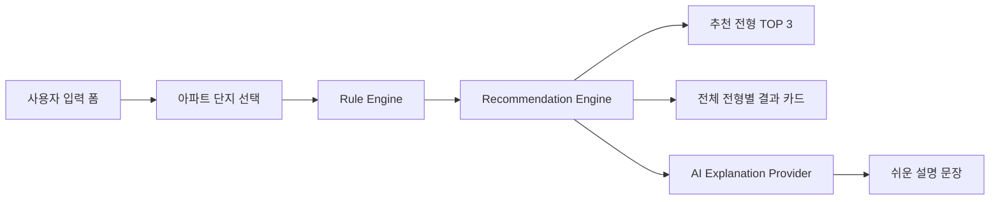

# MyHome 청약 자격 시뮬레이터

> 청약홈 단지 데이터와 사용자 입력 조건을 바탕으로, **Rule Engine이 청약 전형을 판정**하고 **Recommendation Engine이 우선순위를 정리**하며, **AI는 결과를 쉽게 설명만 하는** 청약 정보 서비스 MVP입니다.

## 1. 프로젝트 개요

MyHome은 사용자가 자신의 조건과 관심 지역, 청약 중인 아파트 단지를 선택하면 다음을 제공합니다.

- 단지별 제공 공급 유형 매칭
- 전형별 `가능 / 주의 / 불가 / 공급 유형 없음` 판정
- 사용자 상황에 맞춘 추천 전형 TOP 3
- 무주택 기간, 혼인 기간, 자녀 수, 통장 조건을 반영한 전략 메모
- 예상 경쟁 강도 참고 지표
- 룰 엔진 결과를 바탕으로 한 AI 쉬운 설명

이 프로젝트의 핵심은 **단순 AI 챗봇이 아니라, 테스트 가능한 비즈니스 로직과 설명형 AI를 분리한 구조**라는 점입니다.

## 2. 문제 정의

청약 정보는 다음 특성을 가집니다.

- 정책성과 공고 의존성이 높다.
- 같은 사용자라도 단지별 공급 유형에 따라 결과가 달라진다.
- 사용자는 “내가 가능한가?”뿐 아니라 “무엇을 먼저 노려야 하는가?”를 알고 싶어 한다.
- LLM이 정책성 조건을 직접 판정하면 최신성, 재현성, 책임 범위 측면에서 위험하다.

그래서 이 프로젝트는 다음 목표를 잡았습니다.

1. **판정은 코드 기반 Rule Engine으로만 수행한다.**
2. **AI는 판정 결과를 설명하는 보조 계층으로만 둔다.**
3. **Recommendation Engine을 별도로 둬 사용자 맞춤 전략을 정리한다.**
4. **청약홈 API, 관리자 룰 관리, 실 AI 연동으로 확장 가능한 구조를 만든다.**

## 3. 핵심 설계 철학

### Rule Engine과 AI Explanation 분리

- `Rule Engine`
  - 전형별 조건 판정
  - 상태값 계산
  - 부족 조건과 주의 사유 생성
  - 테스트 가능

- `Recommendation Engine`
  - 단지 제공 전형과 사용자 조건을 결합
  - 추천 순위 산정
  - 전략 메모 생성
  - 경쟁 강도 참고 지표 결합

- `AI Explanation`
  - 이미 계산된 판정 결과만 설명
  - 자격 여부를 새로 판단하지 않음
  - mock provider / real provider 분리

이 구조를 선택한 이유는 **정책성 정보를 LLM에게 직접 맡기지 않고, 검증 가능한 로직으로 통제하기 위해서**입니다.

## 4. 아키텍처



```text
app/
  page.tsx
  api/apartments/route.ts
  api/explain/route.ts
  blog/
  guide/
  privacy/
  terms/

components/
  EligibilityForm.tsx
  ResultCard.tsx
  AiExplanationBox.tsx
  Disclaimer.tsx

lib/
  apartments/
  eligibility/
  recommendation/
  ai/
  blog/

tests/
  eligibility-engine.test.ts
```

## 5. 주요 기능

### 사용자 입력

- 나이
- 혼인 여부, 혼인 기간
- 자녀 수
- 무주택 여부, 무주택 기간
- 세대주 여부
- 청약통장 보유 여부
- 청약통장 가입 기간, 납입 횟수
- 월평균 소득, 자산 금액
- 현재 거주 지역
- 희망 지역
- 관심 공급 유형

### 단지별 전형 매칭

- 선택한 지역 기준 단지 필터링
- 단지별 모집 상태, 접수 기간, 주택 유형 표시
- 단지에서 제공하지 않는 전형은 `not_available` 처리

### 추천 엔진

- 특별공급 우선 검토
- 일반공급과 특별공급 비교
- 무주택 기간이 짧은 경우 특별공급 검토 가중
- 무주택 기간이 긴 경우 일반공급 비교 가치 반영
- 자녀 수, 혼인 상태, 통장 조건에 따른 전략 메모 생성

예시:

- “무주택 기간이 짧아 일반공급 가점 경쟁보다 조건형 특별공급을 우선 검토하는 전략이 유리할 수 있습니다.”
- “혼인 기간이 신혼부부 특별공급 검토 범위에 가까워 우선 확인할 가치가 있습니다.”

### AI 쉬운 설명

- 판정 결과를 설명하는 버튼형 호출
- mock provider 기본 동작
- real provider로 교체 가능한 interface 구조
- 동일 입력/동일 결과 캐싱 확장 가능

### SEO / AdSense 준비

- `robots.ts`, `sitemap.ts`
- `/blog` 및 상세 글 SSG 생성
- `/about`, `/guide`, `/faq`, `/privacy`, `/terms`, `/contact`
- `public/ads.txt` 샘플 포함
- AdSense client 환경변수 구조 분리

## 6. 기술 스택과 선택 이유

| 기술 | 선택 이유 |
| --- | --- |
| Next.js App Router | 페이지 라우팅, API route, 메타데이터, SSG를 한 프로젝트에서 관리하기 좋음 |
| TypeScript | 정책성 로직의 타입 안정성을 높이고, 추천/판정 결과 shape를 명확히 유지 |
| Tailwind CSS | 빠르게 세련된 인터페이스를 구현하고 반응형 설계를 유지 |
| shadcn/ui 스타일 설계 | 운영형 SaaS처럼 정돈된 정보 밀도와 컴포넌트 일관성 확보 |
| Vitest | Rule Engine과 Recommendation Engine을 빠르게 단위 테스트 |
| 청약홈 공공 API | 데모 데이터를 넘어 실제 현재 청약 단지 목록을 표시하기 위해 사용 |
| Provider Pattern | AI 설명 기능을 mock / real provider로 분리해 개발성과 교체성을 높임 |
| Mermaid / SEO 페이지 | 면접 포트폴리오와 검색엔진 노출 양쪽을 고려한 문서화 |

## 7. 실행 방법

```bash
npm install
npm run dev
```

브라우저에서 아래 주소로 접속합니다.

```text
http://localhost:3000
```

## 8. 환경변수

`.env.example`을 참고합니다.

```env
APPLY_HOME_SERVICE_KEY=공공데이터포털_청약홈_API_인증키
APPLY_HOME_API_BASE_URL=https://api.odcloud.kr/api/ApplyhomeInfoDetailSvc/v1
NEXT_PUBLIC_SITE_URL=https://your-domain.com
NEXT_PUBLIC_ADSENSE_CLIENT=ca-pub-0000000000000000
```

## 9. 테스트 방법

```bash
npm run lint
npm test
npm run build
```

현재 검증 항목:

- 신혼부부 특별공급 가능/주의 판정
- 주택 보유자의 특별공급 불가 처리
- 청약통장 미보유 시 불가/주의 처리
- 소득/자산 누락 시 주의 처리
- 단지에 없는 공급 유형 `not_available`
- 추천 1순위 전형 검증
- 특별공급 불리 시 일반공급 추천
- 무주택 기간 기반 전략 메모 생성

## 10. 비용 절감 설계

AI 호출은 기본 동작이 아닙니다.

- 결과를 먼저 룰 엔진으로 계산
- 사용자가 버튼을 눌렀을 때만 AI 설명 요청
- mock provider로 로컬 개발 가능
- 실 AI 도입 시 동일 입력·동일 결과 캐싱 가능

이 구조는 **불필요한 토큰 사용을 줄이고**, **핵심 기능은 AI 장애와 무관하게 동작**하게 합니다.

## 11. 한계와 주의사항

- 이 프로젝트는 **법률 자문 서비스가 아닙니다.**
- 샘플 룰과 추천 기준은 MVP용입니다.
- 실제 청약 가능 여부는 반드시 **청약홈과 해당 단지 모집공고문**을 기준으로 확인해야 합니다.
- 예상 경쟁 강도는 실제 경쟁률 예측이 아닌 참고용 비교 지표입니다.
- 정책/법령 기준은 수동 업데이트 구조를 전제로 합니다.

## 12. 향후 개선 방향

- Supabase 기반 룰 버전 관리
- 관리자용 룰 관리 페이지
- 모집공고 PDF 구조화
- OpenAI real provider 연동
- 설명 응답 캐싱 저장소 고도화
- 실제 경쟁률/분양가/입지 지표와 추천 엔진 결합
- 사용자 저장 기능과 비교 리포트

## 13. 면접에서 어필할 포인트

### 1. 단순한 AI 챗봇이 아니라는 점

핵심 판단은 Rule Engine이 수행하고, AI는 설명 계층으로만 제한했습니다. 정책성 도메인에서 AI를 어디까지 믿고 어디서 통제해야 하는지 설계 판단을 보여줍니다.

### 2. 비즈니스 로직을 테스트 가능한 구조로 분리한 점

UI와 판정 로직을 분리했고, Recommendation Engine까지 별도 계층으로 나눴습니다. 그래서 테스트가 쉽고, 룰 변경에도 영향을 국소화할 수 있습니다.

### 3. 비용과 운영까지 생각한 제품 설계

AI 호출을 버튼식으로 분리하고 provider 구조를 둬서, 기능 품질과 운영 비용을 동시에 고려했습니다.

### 4. 확장 가능성을 고려한 타입 설계

룰 버전, 기준일, 출처 메모를 데이터 구조에 포함해 향후 관리자 페이지와 Supabase 이전을 염두에 두었습니다.

### 5. 실제 사용자 문제에 가까운 추천 기능

단순히 “가능/불가”를 보여주는 데서 끝나지 않고, 사용자의 상황에 맞춰 “어떤 전형을 먼저 검토해야 하는지”까지 제안합니다.

## 14. 현재 상태

- TypeScript 타입 체크 통과
- Vitest 테스트 통과
- Next.js production build 통과
- 청약홈 API 구조 반영
- SEO/AdSense 준비 페이지 포함

## 15. 배포 전 체크리스트

- `NEXT_PUBLIC_SITE_URL`을 실제 운영 도메인으로 교체
- `APPLY_HOME_SERVICE_KEY`를 배포 환경변수에 등록
- `NEXT_PUBLIC_ADSENSE_CLIENT`를 실제 `ca-pub-*` 값으로 교체
- `public/ads.txt`의 게시자 ID를 실제 값으로 수정
- Google Search Console에 사이트 등록 후 `sitemap.xml` 제출
- 배포 환경에서 `/api/apartments`, `/api/explain`, `/blog/*` 라우트 정상 동작 확인

## 16. 면접 데모 시나리오

1. 메인 화면에서 청약 중인 단지 목록과 서비스 목적을 빠르게 소개합니다.
2. 시뮬레이터에서 `무주택 기간 1년`, `기혼`, `혼인 3년`, `청약통장 보유` 조건을 입력합니다.
3. 결과 화면에서 신혼부부 특별공급이 상위 추천으로 올라오고, “무주택 기간이 짧아 특별공급을 우선 검토”하는 전략 메모가 생성되는 흐름을 설명합니다.
4. AI 쉬운 설명 버튼을 눌러, AI가 직접 판정하지 않고 Rule Engine 결과만 설명한다는 구조를 보여줍니다.
5. 마지막으로 테스트 코드와 README를 열어, 제품 기능뿐 아니라 설계 판단과 검증까지 했다는 점을 강조합니다.
